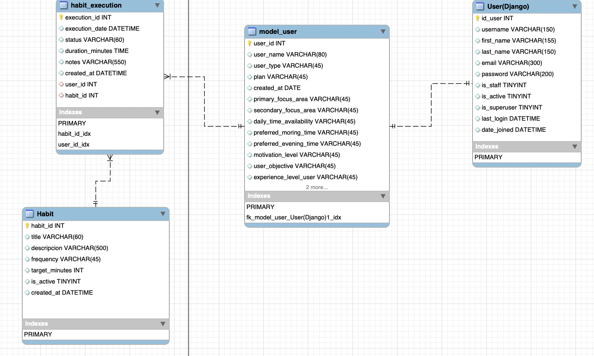

# 📌 Modelamiento de la Base de Datos - MVP

Este proyecto contiene el diseño del modelo de base de datos para la **gestión de hábitos y usuarios**.  
El modelamiento se realizó considerando las entidades principales: **usuarios, hábitos y ejecuciones de hábitos**.

---

## 📂 Estructura de Tablas

- **User (Django):** maneja la autenticación y credenciales básicas.  
- **Model_User:** almacena información adicional del perfil del usuario (objetivos, tiempo disponible, nivel de motivación, etc.).  
- **Habit:** define los hábitos creados por los usuarios.  
- **Habit_Execution:** registra cada ejecución de un hábito (fecha, duración, estado, notas, etc.).  

---

## 📊 Diagrama de la Base de Datos

